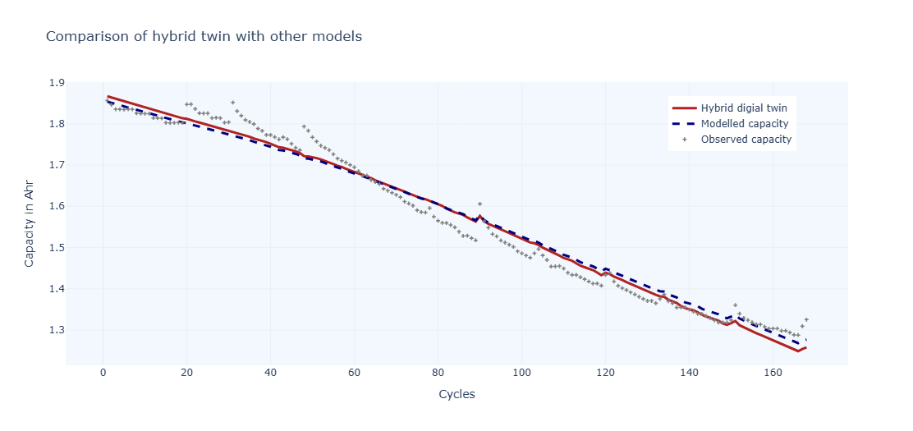

# Digital Twin for Li-ion Battery Capacity Prediction
This project implements a **digital twin** approach to model and predict the capacity degradation of Li-ion batteries across charge-discharge cycles. The objective is to simulate the real battery behavior using mathematical models and compare the results with actual data.

---

## Dataset
The project uses cycle-wise data representing battery capacity over multiple charging cycles. The dataset includes:

- **Cycle Count**: Number of charge-discharge cycles
- **Battery Capacity**: Remaining capacity at each cycle

---

## Models Implemented
The project implements and compares multiple capacity degradation models:

### 1. Exponential Decay Model
**Mathematical form:**

```

C(N) = a \* e^{-bN} + c

```

Where:
- `C(N)`: Capacity at cycle `N`
- `a, b, c`: Fitting parameters

### 2. Polynomial Model
**Mathematical form:**

```

C(N) = aN^2 + bN + c

```

Where `a, b, c` are coefficients obtained by fitting.

### 3. Combined Exponential & Linear Model
**Mathematical form:**

```

C(N) = a \* e^{-bN} + cN + d

```

Where `a, b, c, d` are fitting parameters.

---

## Tools and Libraries Used

- **Python 3.x**
- **NumPy**: Numerical operations
- **SciPy**: Curve fitting (`scipy.optimize.curve_fit`)
- **Plotly**: Interactive visualization
- **Matplotlib (optional)**

---

## Workflow

1. **Load Data**: Load the cycle vs. capacity data.
2. **Define Model Functions**: Implement mathematical functions for different models.
3. **Curve Fitting**: Use `curve_fit` from SciPy to fit models to data.
4. **Prediction**: Use fitted parameters to predict capacity for future cycles.
5. **Visualization**: Plot actual data vs model predictions.

---

## Example Output

The following image shows the comparison of the hybrid digital twin with the observed and modeled capacity:



- **Red line**: Hybrid digital twin prediction
- **Blue dashed line**: Modelled capacity
- **Gray dots**: Observed capacity

---
